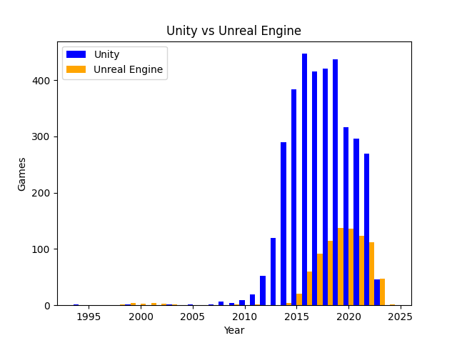

# Game Engine Trend Prediction (Unity vs Unreal)

This project performs data preprocessing, visualization, and classification to analyze the usage trends of Unity and Unreal Engine over the years, and predict which engine is likely to remain more popular by 2026.

The core goals of this project were to:
- Preprocess a dataset containing game release information and the engine used.
- Visualize historical trends of Unity vs Unreal Engine using `matplotlib`.
- Train a classifier to predict the popularity of game engines in the future.
- Use a **Random Forest classifier**, achieving an **accuracy of ~80%**.
- Predict the dominant engine in 2026 based on historical patterns — **Unity** was forecasted to maintain its lead.

## Visualizations

Trend visualizations show the number of games developed with Unity and Unreal Engine over time. These help provide insight into the historical usage patterns that inform the prediction.

<p align="center">
  
</p>

## Model Summary

- **Algorithm**: Random Forest Classifier  
- **Features**: Preprocessed attributes like release year and engine usage patterns  
- **Target**: Game engine used  
- **Training Accuracy**: ~80%  
- **2026 Prediction**: Unity is projected to continue being the more widely used engine

## How to Run

 ```bash
   git clone https://github.com/Sengeki1/Engines_Statistics.git
   cd Engines_Statistics
```

```bash
    pip install -r requirements.txt
```

```bash
    python main.py
```